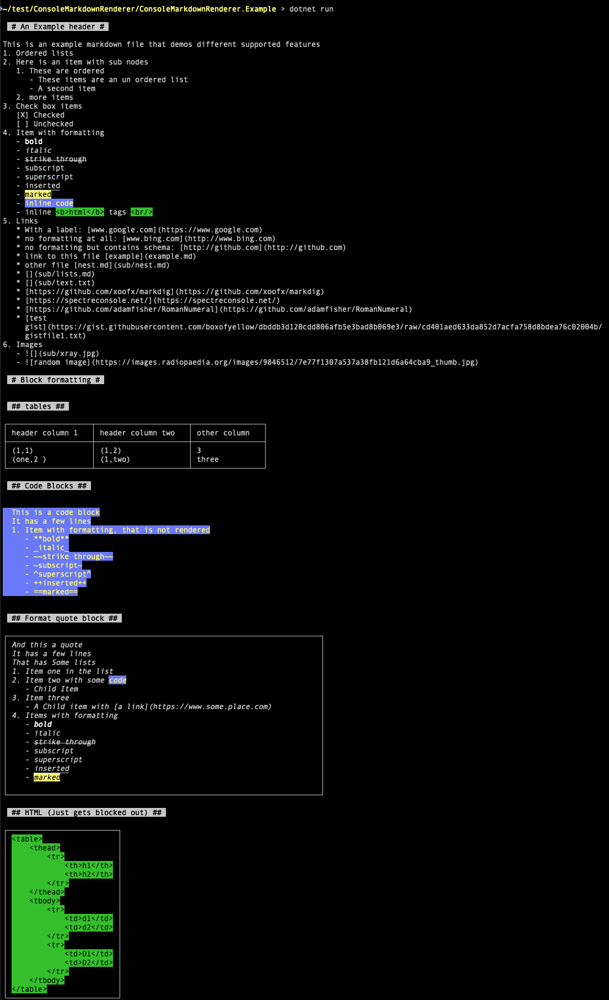

  

# _I_ have markdown files, _you_ have markdown files we _all_ have markdown files...

We create them to document various parts of projects.  Sometimes that documentation would be helpful _while_ folks are using those projects.  And thats where this library comes in.  This Library provides support for displaying markdown within the console and provides a simple navigation list of links and images within the document.  When items from the list are selected their content will be shown inline when possible (aka it's another markdown file, or it's an image and the console appears to be using [iTerm2]((https://iterm2.com/)))

I will totally admit `README.md` files and response that is displayed with `--help` are not 100% interchangeable, but there is a lot of overlap :slightly_smiling_face:

## Using it is simple
Just call the one public method from the static [Displayer.cs](Displayer.cs) class called `DisplayMarkdown` it accepts the following parameters

| name | type | description | required/default |
| - | - | - | - |
| `uri` | `Uri` | The [Uri](https://en.wikipedia.org/wiki/Uniform_Resource_Identifier) that is either a file containing your markdown, or the web address where said content can be downloaded | Yes |
| `allowFollowingLinks` | `bool` | A flag, when set to true, the list of links will be provided, when false the list is omitted | no / `true` |
| `includeDebug` | `bool` | A flag, when set to true the content structure is displayed and detail of unsupported markdown is displayed | no / `false` |

Checkout [ConsoleMarkdownRenderer.Example](ConsoleMarkdownRenderer.Example) to see it in use

## Supporting packages 

It's also important to give credit where credit is due, this library is really just glue for the following packages
- [Markdig](https://www.nuget.org/packages/Markdig/) for parsing the markdown
- [Spectre.Console](https://www.nuget.org/packages/Spectre.Console/) for display rich formatting within the console
- [RomanNumeral](https://www.nuget.org/packages/RomanNumeral/) for minimal roman numeral processing

## Contributing

Contributions are welcome, please see [CONTRIBUTING.md](CONTRIBUTING.md) and [CODE_OF_CONDUCT.md](CODE_OF_CONDUCT.md)
